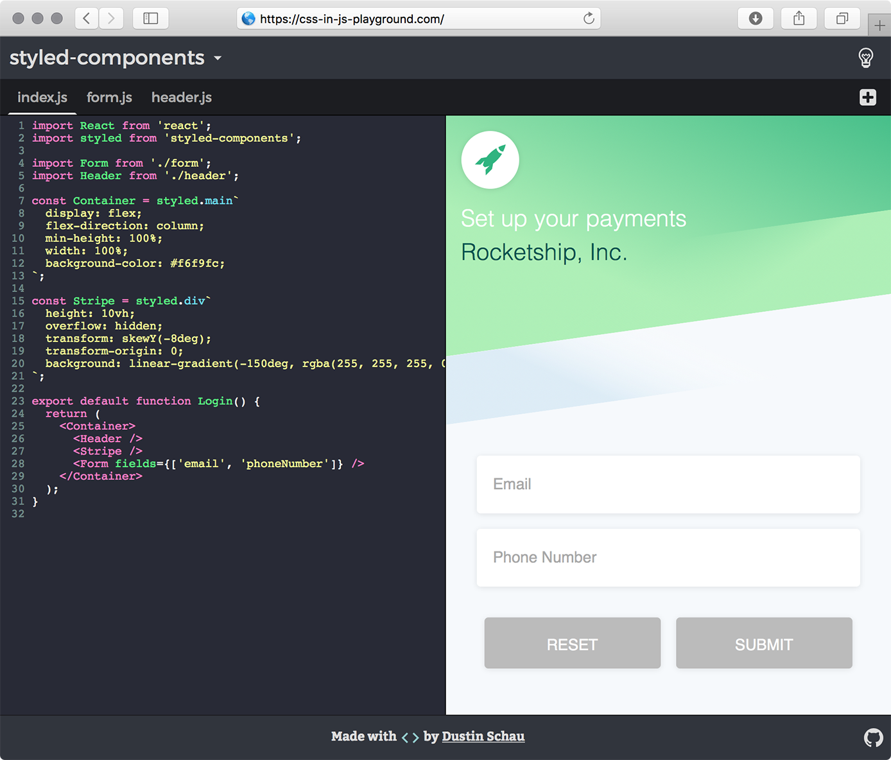

# css-in-js-playground

A simple CodeMirror editor showcasing the various CSS in JS (or JSS) styling solutions. Content is previewed live from the editor, and various styling solutions can be swapped out to see how various code snippets look in each.

## Currently supported libraries

<!-- AUTO-GENERATED-CONTENT:START (LIBRARIES) -->
- [aphrodite](./src/snippets/aphrodite.js)
- [cxs](./src/snippets/cxs.js)
- [glamorous](./src/snippets/glamorous.js)
- [radium](./src/snippets/radium.js)
- [styled-components](./src/snippets/styled-components.js)
<!-- AUTO-GENERATED-CONTENT:END (LIBRARIES) -->

## Credits

[Stripe][stripe], from which their simple form mockup I used as the reference material to build each of the examples.

[stripe]: https://stripe.com/connect
