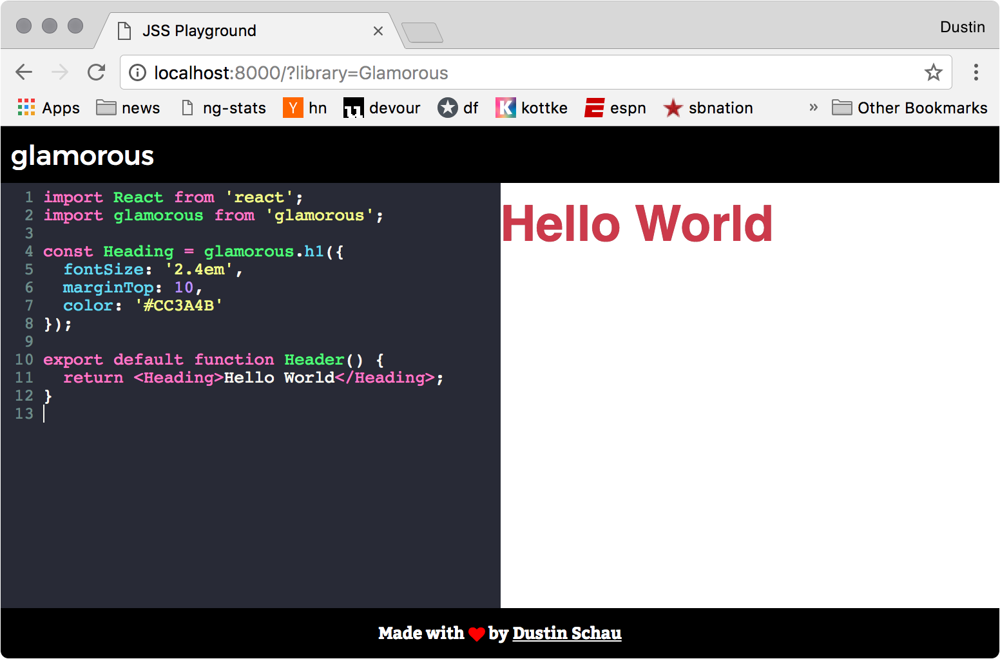

# jss-playground

**WORK IN PROGRESS**

A simple CodeMirror editor showcasing the various CSS in JS (or JSS) styling solutions. Content is previewed live from the editor, and various styling solutions can be swapped out to see how code looks in each.

## Currently supported libraries

<!-- AUTO-GENERATED-CONTENT:START (LIBRARIES) -->
- [aphrodite](./src/snippets/aphrodite.js)
- [cxs](./src/snippets/cxs.js)
- [emotion](./src/snippets/emotion.js)
- [glam](./src/snippets/glam.js)
- [glamor](./src/snippets/glamor.js)
- [glamorous](./src/snippets/glamorous.js)
- [radium](./src/snippets/radium.js)
- [styled-components](./src/snippets/styled-components.js)
<!-- AUTO-GENERATED-CONTENT:END (LIBRARIES) -->
